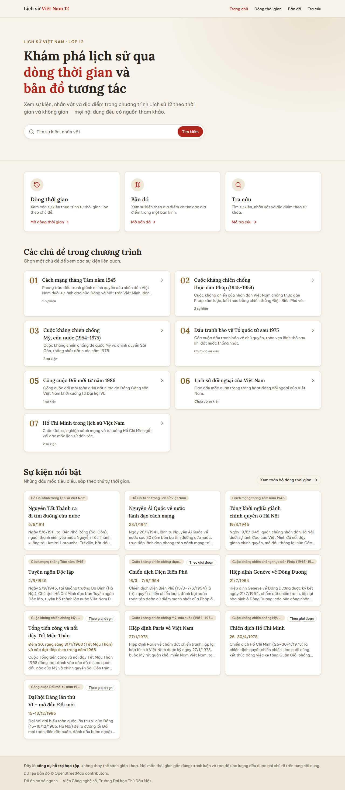

# Lịch sử Việt Nam 12

Web hỗ trợ học sinh lớp 12 tìm hiểu Lịch sử Việt Nam qua **dòng thời gian, bản đồ, ảnh tư liệu và bài học tương tác**.
Nội dung bám theo SGK Lịch sử 12 (bộ *Kết nối tri thức với cuộc sống*). Mọi nội dung đều qua quy trình
**biên tập → kiểm duyệt → công bố**, và sự kiện bắt buộc phải có nguồn tham khảo.

> Đồ án cơ sở ngành, Viện Công nghệ số, Trường Đại học Thủ Dầu Một.
> Đây là công cụ hỗ trợ học tập, **không thay thế sách giáo khoa**.



## Tính năng chính

| Trang | Đường dẫn | Nội dung |
|---|---|---|
| Trang chủ | `/` | Tìm nhanh, bài học tương tác, chủ đề, sự kiện nổi bật |
| Bài học tương tác | `/bai-hoc` | Ví dụ *Chiến dịch Điện Biên Phủ*: bản đồ diễn biến 7 bước, ảnh tư liệu, video, thẻ ghi nhớ, mô hình 3D |
| Bản đồ 3D "như phim" | `/ban-do-3d/dien-bien-phu` | Chiến dịch diễn ra trên địa hình thật (MapLibre + Three.js) |
| Phim 3D | `/phim-3d/doi-a1` | "Đồi A1, đêm 6/5/1954" dựng trong trình duyệt, có thuyết minh và phụ đề |
| Dòng thời gian | `/dong-thoi-gian` | Sự kiện theo năm, lọc theo chủ đề |
| Bản đồ | `/ban-do` | Địa điểm lịch sử (Leaflet), tìm theo bán kính (PostGIS) |
| Tra cứu | `/tra-cuu` | Tìm sự kiện, nhân vật, địa điểm; gõ không dấu vẫn được |
| Chi tiết | `/su-kien/…`, `/nhan-vat/…`, `/dia-diem/…`, `/chu-de/…` | Nội dung, ảnh có ghi công, nguồn tham khảo |
| Quản trị | `/quan-tri` | Soạn nội dung, kiểm duyệt, quản lý nhân sự, vận hành (cần đăng nhập) |

## Công nghệ

- **Next.js 16** (App Router, Turbopack), React 19, TypeScript, Tailwind CSS 4
- **Supabase**: PostgreSQL 17 + PostGIS, Auth, Storage, Row Level Security (48 policy)
- Bản đồ: Leaflet (2D), MapLibre GL (3D); đồ họa 3D: Three.js
- Kiểm thử: Vitest (unit), Playwright (E2E), script kiểm thử RLS trên database thật, Lighthouse

> **Lưu ý cho người sửa code:** Next.js 16 có nhiều thay đổi so với các bản cũ. Đọc tài liệu đi kèm trong
> `node_modules/next/dist/docs/` trước khi viết code (xem `AGENTS.md`).

## Cài đặt

Yêu cầu: **Node.js 20.9** trở lên (dự án được phát triển trên Node 24), một project Supabase (gói miễn phí là đủ).

```bash
git clone https://github.com/tronghp160/WEB_LICH-SU_12.git
cd WEB_LICH-SU_12
npm install
cp .env.example .env.local   # rồi điền giá trị thật
```

### Biến môi trường (`.env.local`)

| Biến | Bắt buộc | Dùng ở đâu |
|---|:-:|---|
| `NEXT_PUBLIC_SUPABASE_URL` | ✅ | URL project Supabase |
| `NEXT_PUBLIC_SUPABASE_PUBLISHABLE_KEY` | ✅ | Khóa công khai (đã có RLS bảo vệ) |
| `SUPABASE_SECRET_KEY` | Cho trang Nhân sự | **Chỉ phía server**: tạo/khóa tài khoản nhân sự. Không bao giờ thêm tiền tố `NEXT_PUBLIC_` |
| `DATABASE_URL` | Tùy chọn | Chạy migration/seed bằng Supabase CLI |

Lấy các giá trị trong Supabase Dashboard → *Project Settings → API* (và *Connect* cho `DATABASE_URL`).

### Tạo database

Chạy **theo đúng thứ tự tên file**, mỗi file **một lần**, trong SQL Editor của Supabase hoặc bằng CLI:

```bash
# 1. Schema, trigger, RLS, storage…
for f in supabase/migrations/*.sql; do npx supabase db query --db-url "$DATABASE_URL" --file "$f"; done
# 2. Dữ liệu mẫu: 7 chủ đề, 10 sự kiện, 9 nhân vật, 11 địa điểm, nguồn và ảnh
npx supabase db query --db-url "$DATABASE_URL" --file supabase/seed.sql
```

Tài khoản nhân sự đầu tiên: tạo user trong *Authentication → Users*, rồi thêm hồ sơ vai trò theo hướng dẫn trong
`supabase/staff-test-accounts.sql`. Tài khoản `@test.local` trong file đó **chỉ để thử**. Xóa hoặc đổi mật khẩu trước khi công khai.

### Chạy

```bash
npm run dev      # http://localhost:3000
npm run build && npm start   # bản production
```

`predev`/`prebuild` tự chép worker của MapLibre vào `public/vendor/` (đã được gitignore).

## Kiểm thử

| Bộ | Lệnh |
|---|---|
| Unit test | `npm test` |
| Lint, kiểu | `npm run lint`, `npx tsc --noEmit` |
| E2E (cần bản build và tài khoản thử) | `TEST_PW='…' npm run test:e2e` |
| Phân quyền RLS trên DB thật | `TEST_PW='…' node tests/rls/matrix.mjs` |
| Ràng buộc CSDL | chạy `supabase/tests/constraints.sql` (tự hoàn tác) |

Kết quả chi tiết: [`docs/test-report.md`](docs/test-report.md).

## Cấu trúc thư mục

```
app/(public)/      Trang công khai (trang chủ, bài học, bản đồ, dòng thời gian, chi tiết…)
app/quan-tri/      Trang quản trị: nội dung, kiểm duyệt, nhân sự, vận hành
components/        Giao diện, chia theo khu vực (home, content, map, lesson, mapfilm, cinema3d, model3d, admin…)
lib/queries/       Truy vấn Supabase phía server
lib/actions/       Server Actions (lưu, gửi duyệt, duyệt…)
lib/validation/    Zod schema cho form
lib/admin/         Luật nghiệp vụ quản trị (điều kiện gửi duyệt, quyền theo vai trò…)
lib/lessons/       Bài học tương tác (dữ liệu viết trong code)
lib/battles/       Kịch bản bản đồ diễn biến
lib/mapfilm/       Kịch bản bản đồ 3D; lib/cinema: phim 3D; lib/models3d: mô hình 3D
supabase/          migrations/, seed.sql, tests/constraints.sql
tests/             unit/ (Vitest), e2e/ (Playwright), rls/ (DB thật), perf/
docs/              Báo cáo kiểm thử, dữ liệu cần kiểm chứng, lộ trình bài học, ảnh chụp màn hình
public/            Ảnh bài học (webp đã nén), địa hình, mô hình 3D
```

## Nội dung và bản quyền ảnh

- Mỗi ảnh ghi **tác giả, giấy phép và link trang gốc**. Ảnh dựng lại, tô màu hay minh họa đều gắn nhãn rõ.
- Danh sách dữ liệu còn phải đối chiếu với SGK: [`docs/du-lieu-can-kiem-chung.md`](docs/du-lieu-can-kiem-chung.md).
  Trang quản trị không cho gửi duyệt nội dung còn chữ `TODO` ở phần hiển thị công khai.
- Dữ liệu bản đồ © [OpenStreetMap contributors](https://www.openstreetmap.org/copyright).
