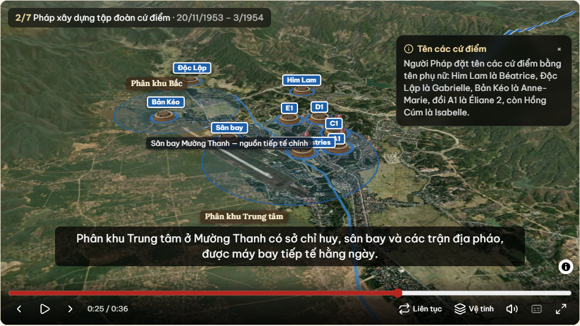
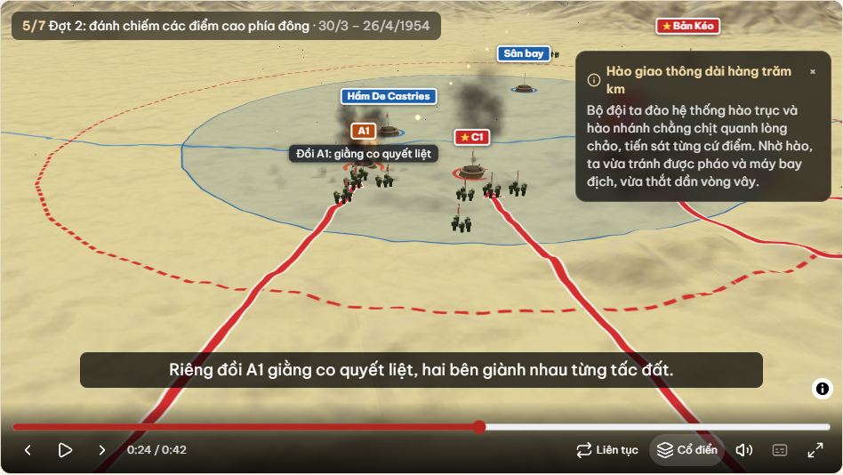
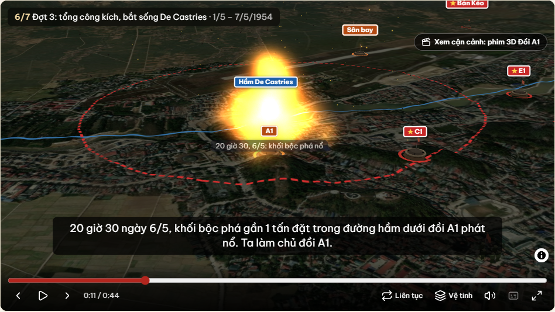
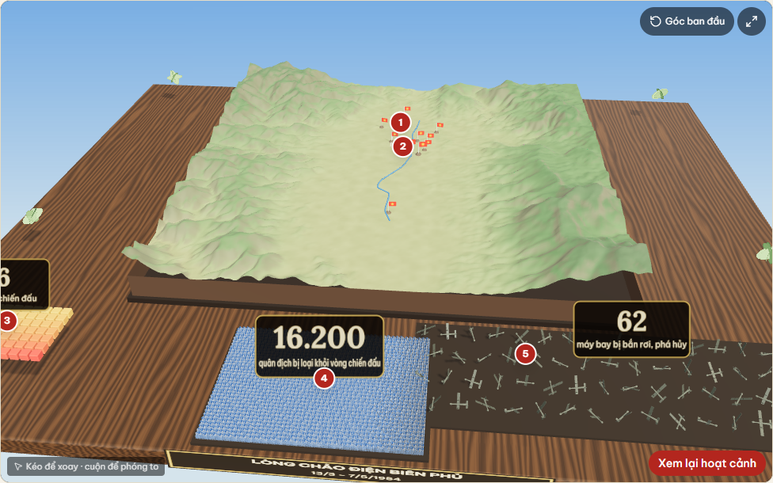
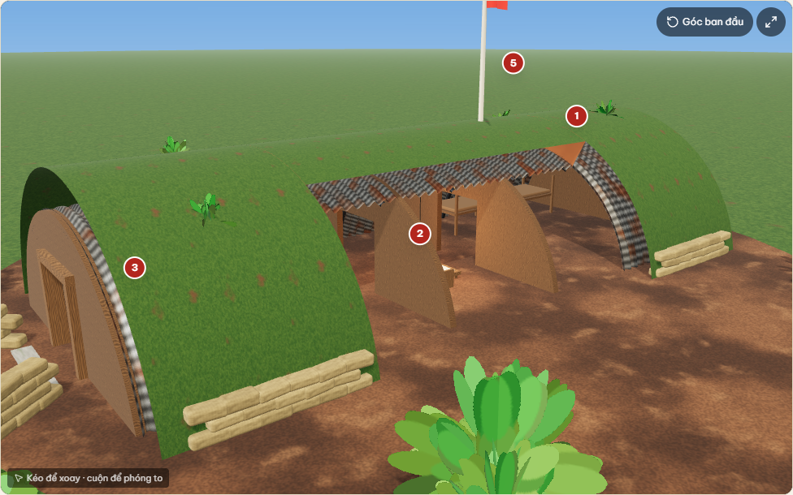
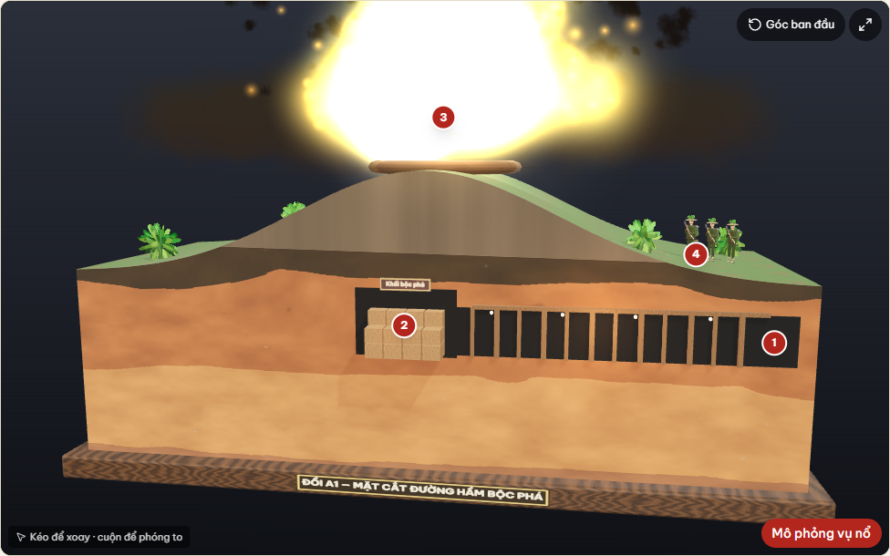
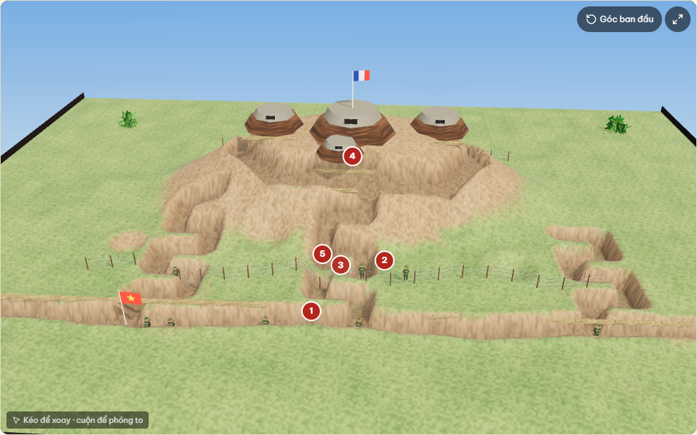
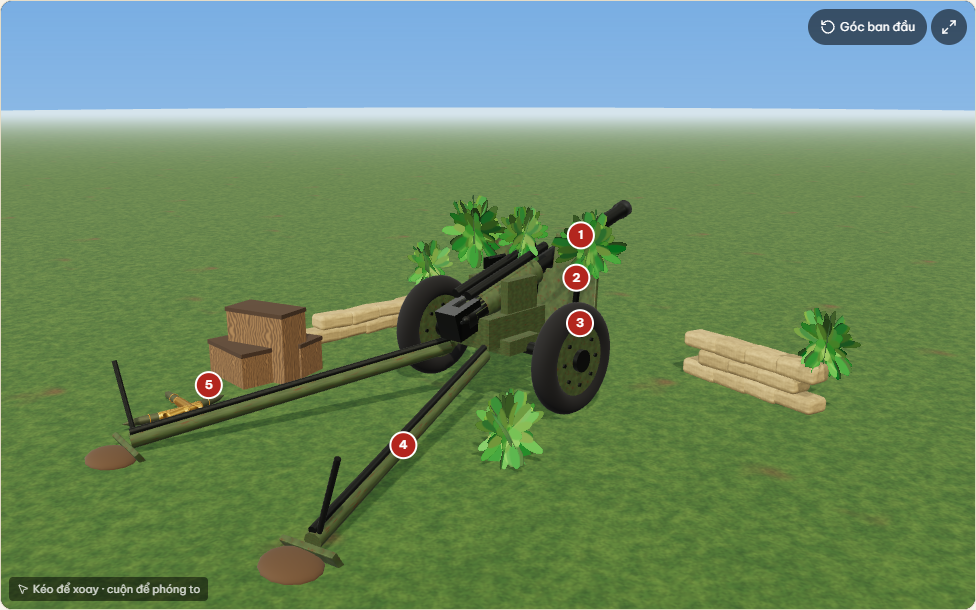
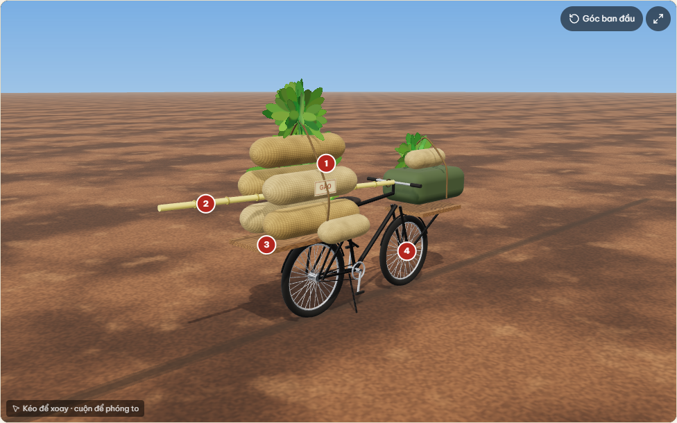
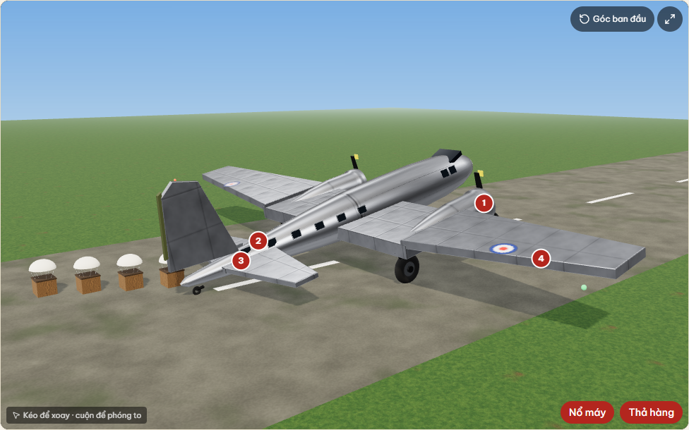

# Bài học tương tác — bản mẫu Chiến dịch Điện Biên Phủ

Trang: `/bai-hoc/chien-dich-dien-bien-phu`. Lối vào có ở trang chủ (mục "Bài học tương tác") và trên trang sự kiện Điện Biên Phủ (nút "Xem bài học tương tác").

## Chạy để demo

```bash
npm run build
npx next start -p 3000      # bản production chạy mượt hơn `npm run dev`
```

Mở http://localhost:3000. Cần mạng Internet để tải nền bản đồ OpenStreetMap và phát video YouTube; ảnh tư liệu nằm sẵn trong `public/`.

## Kịch bản demo (khoảng 3 phút)

1. **Trang chủ**: cuộn xuống mục "Bài học tương tác", chỉ thẻ Điện Biên Phủ có ảnh nền, rồi bấm vào.
   Có thể đi đường khác: vào Dòng thời gian → Chiến dịch Điện Biên Phủ → nút đỏ "Xem bài học tương tác".
2. **Mở đầu**: ảnh cắm cờ trên nóc hầm De Castries zoom chậm, ba con số (56 ngày đêm, 49 cứ điểm, 16.200 quân) tự đếm lên. Bấm "Bắt đầu bài học".
3. **Mục tiêu theo SGK** và **dòng thời gian 8 mốc** hiện dần khi cuộn.
4. **Bản đồ diễn biến**: bấm **Phát** rồi để bản đồ tự chạy, hoặc bấm từng bước:
   - Bước 1: toàn cảnh Đông Dương, giới thiệu kế hoạch Nava.
   - Bước 2: bản đồ bay vào lòng chảo, hiện 3 phân khu và 10 cứ điểm màu xanh (địch).
   - Bước 3: đường kéo pháo nét đứt, trận địa pháo, sở chỉ huy Mường Phăng, vòng vây ngoài. Kèm thẻ "Bạn có biết?" về Tô Vĩnh Diện và ảnh kéo pháo.
   - Bước 4: mũi tên đỏ vẽ dần vào Him Lam, Độc Lập, Bản Kéo; các cứ điểm này chuyển sang đỏ có sao vàng. Kèm thẻ về Phan Đình Giót.
   - Bước 5: đánh E1, D1, C1; A1 và sân bay nhấp nháy viền đỏ (đang giằng co); vòng vây siết lại.
   - Bước 6–7: hầm De Castries bị chiếm, kèm ảnh cắm cờ; toàn bộ cứ điểm bị tiêu diệt.
5. **Video**: bấm phát video QPVN. Nhắc người xem rằng video chỉ tải khi bấm, nên trang vẫn nhanh.
6. **Kết quả và ý nghĩa**: số liệu đếm động, 4 ý nghĩa, câu thơ Tố Hữu.
7. **Nhân vật**: bấm lật thẻ De Castries và Võ Nguyên Giáp.
8. **Di tích ngày nay**: hầm De Castries, hố bộc phá A1, chiến hào, tượng đài D1.
9. **Ghi nhớ nhanh**: đọc câu hỏi, bấm lật để xem đáp án.

## Kỹ thuật

- Dữ liệu viết cứng: `lib/lessons/dien-bien-phu.ts` (bài học) và `lib/battles/dien-bien-phu-1954.ts` (bản đồ). Demo không đụng database và không có migration.
- Bộ mô phỏng dùng chung với Bạch Đằng (`components/battle/*`). Hỗ trợ camera bay theo bước, cứ điểm (đang giữ / đang bị tiến công / đã tiêu diệt), mũi tên vẽ dần, vùng (phân khu, vòng vây), thẻ "Bạn có biết?" và ảnh theo bước.
- Không thêm thư viện: hiệu ứng dùng CSS, `requestAnimationFrame` và `IntersectionObserver`. Khi người dùng bật "giảm chuyển động", mọi hiệu ứng tắt.
- Màu theo quy ước bản đồ lịch sử Việt Nam: quân ta đỏ, địch xanh. Các loại biểu tượng còn khác nhau về hình dáng, nên người khó phân biệt màu vẫn đọc được.
- Tọa độ cứ điểm tra từ OpenStreetMap. Bản Kéo và Hồng Cúm không có trên OSM nên đặt vị trí gần đúng; trang có ghi chú điều này.
- Ảnh lấy từ Wikimedia Commons, đã kiểm tra giấy phép (phạm vi công cộng, CC BY, CC BY-SA), nén webp ≤ 250 KB. Mỗi ảnh có dòng ghi công và link tới trang gốc.
- Video nhúng qua `youtube-nocookie.com`, chỉ tải khi bấm. Đã xác minh bằng YouTube oEmbed ngày 24/9/2026:
  - `qvE5Zd9kHPY`: QPVN – Truyền hình Quốc phòng Việt Nam.
  - `JJVn9hFeaPE`: THVL Tổng Hợp, "Tay không kéo pháo".
  - `kPpJD6UzSPU`: VTV4, "Điện Biên Phủ – Cuộc chiến vì hòa bình".
- Kiểm thử:
  - `tests/unit/lesson-data.test.ts` và `tests/unit/battle-animation.test.ts`.
  - `tests/e2e/lesson.spec.ts` (10 ca) và `tests/e2e/battle.spec.ts`.
- Lighthouse, bản build chạy trên máy phát triển:

  | | Hiệu năng | Trợ năng | Thực hành tốt nhất | SEO |
  |---|---|---|---|---|
  | Mobile | 80 | 100 | 100 | 100 |
  | Desktop | 99 | 100 | 100 | 100 |

## Cần đối chiếu với SGK Kết nối tri thức

Danh sách nằm ở `toVerify` trong `lib/lessons/dien-bien-phu.ts` và hiện trong mục "Ghi chú biên soạn" cuối trang:
- Số bài và số trang.
- Các con số: 49 cứ điểm, 16.200 quân, 62 máy bay.
- Ngày của ba đợt tiến công.
- Khối bộc phá A1 "gần 1 tấn".
- Cách viết "Giơnevơ".
- Câu thơ Tố Hữu.

Nội dung được viết lại bằng lời của nhóm, không chép nguyên văn SGK.

## Lộ trình sau demo

1. **Làm giàu nội dung 10 sự kiện hiện có** theo khung SGK: Bối cảnh, Diễn biến, Kết quả, Ý nghĩa, khoảng 400–800 chữ mỗi sự kiện, kèm 2–4 ảnh có giấy phép. Trang chi tiết hỗ trợ tiêu đề mục.
2. **Đưa bài học vào database** để biên tập viên tự soạn:
   - Bảng `lessons` và `lesson_steps`.
   - `media_type` thêm `'video'`.
   - RLS theo quy trình biên tập → kiểm duyệt → công bố.
   - Form có chọn điểm trên bản đồ.
   - Cần migration; sẽ trình duyệt trước khi chạy.
3. **Thêm 4–5 bài học**:
   - Cách mạng tháng Tám 1945: bản đồ khởi nghĩa lan rộng theo ngày.
   - Chiến dịch Hồ Chí Minh 1975: 5 cánh quân.
   - Tết Mậu Thân 1968.
   - Hiệp định Paris.
   - Chiến dịch Biên giới 1950.
4. **Tùy chọn (Phase 15)**: địa hình 3D lòng chảo Điện Biên Phủ, ảnh 360° tại đồi A1. Chỉ tải khi người dùng bấm xem.
5. **Triển khai Vercel (Phase 14)** để demo online. Cập nhật báo cáo: phạm vi mới (video, hoạt hình, thẻ ghi nhớ), Use Case "Học bài tương tác", `docs/test-report.md`.

---

## Phim 3D "Đồi A1, đêm 6/5/1954"

Trang riêng: `/phim-3d/doi-a1`; cũng nhúng trong bài học Điện Biên Phủ (mục "Phim 3D"). Thời lượng 1 phút 50 giây.

### Người xem thấy gì
- 8 chương: toàn cảnh Mường Thanh về đêm → đồi A1 → **đường hầm và khối bộc phá nhìn xuyên đất** (có nhãn chú thích) → chiến hào chờ giờ G (20 giờ 30) → **vụ nổ** (chớp trắng, cầu lửa, cột khói, mảnh văng, sóng xung kích, hố bom) → bộ đội xung phong (khoảng 75 người, đạn, lựu đạn, pháo yểm trợ, cháy) → giáp lá cà (địch bị hất ngã, rút lui hoặc giơ tay đầu hàng) → **rạng sáng**, cắm cờ trên đỉnh A1.
- Camera điện ảnh 11 cú máy (cầm tay rung nhẹ, rung mạnh khi nổ); nút **Camera tự do** cho phép kéo chuột xoay và cuộn để phóng to.
- **Âm thanh** tổng hợp tại chỗ: gió, dế, nhịp tim dồn dập, tiếng nổ, súng, kèn xung phong, trống hành quân, chim buổi sáng. Tiếng nổ/súng phát theo vị trí (lệch trái/phải theo camera, nhỏ dần theo khoảng cách) và **đến trễ theo tốc độ âm thanh**: thấy chớp trước, nghe sau. Sau vụ nổ lớn tiếng bị bóp nghẹt, ù tai rồi hồi lại.
- **Thuyết minh tiếng Việt** bằng giọng đọc của trình duyệt (nếu máy có giọng tiếng Việt) và **phụ đề**; có lời thuyết minh dạng văn bản bên dưới.
- Điều khiển: phát/tạm dừng, thanh tua có vạch chương, tắt tiếng, bật/tắt thuyết minh, camera, toàn màn hình. Phím: Cách/K, ←/→ (±5 s), M, C, F.

### Cách làm (không thêm gì ngoài Three.js)
- **Địa hình thật**: ảnh độ cao Terrarium (AWS Open Data) quanh đồi A1, đã tải sẵn thành `public/cinema/dbp-dem-a1.png` (512×512, ~4,4 m/điểm). Dữ liệu SRTM 30 m không phân giải nổi một quả đồi cao ~30 m, nên **đồi A1, chiến hào, công sự là công trình dựng theo mô tả** trên nền địa hình thật; sông núi xung quanh và vị trí sở chỉ huy De Castries theo OpenStreetMap.
- **Không dùng mô hình 3D hay file âm thanh bên ngoài**: người lính (13 khối có xương giả lập: chạy, cúi, bắn, ném, ngã, giơ tay, cắm cờ), hầm, bao cát, rào thép gai, cây, bầu trời sao, dãy núi đều tạo bằng mã. Nhờ vậy không có vấn đề bản quyền mô hình.
- **Tất định theo thời gian**: mọi thứ (vị trí lính, đạn, khói, lửa, camera) là hàm thuần của thời điểm `t` (`lib/cinema/*`, có 39 unit test) nên tua tới bất kỳ giây nào cũng ra đúng hình, không cần mô phỏng liên tục.
- **Tải lười**: Three.js (~190 KB) và địa hình (~320 KB) chỉ tải khi bấm "Xem phim 3D"; trang bài học vẫn Lighthouse mobile 79 / desktop 99 (trợ năng 100). Có tự hạ chất lượng (giảm độ phân giải, tắt bóng đổ và bloom) nếu máy yếu; không có WebGL thì báo rõ; tôn trọng "giảm chuyển động" (tắt rung máy và chớp trắng).

### Giới hạn cần nói thẳng khi demo
- Đây là **đồ họa 3D dạng khối (low-poly)** chạy trong trình duyệt, không phải phim điện ảnh quay hay dựng bằng phần mềm chuyên dụng. Người lính là hình khối cách điệu, không có khuôn mặt hay quân phục chi tiết.
- Số lượng nhân vật, động tác, vị trí công sự được giản lược; trang đã ghi chú "minh họa" ngay dưới phim.
- Các chi tiết cần đối chiếu tài liệu chính thống: đường hầm ~45 m, khối bộc phá ~1 tấn, mốc 20 giờ 30 phút ngày 6/5, "rạng sáng 7/5" làm chủ A1 (có trong danh sách "Ghi chú biên soạn" của bài học).
- Muốn tăng độ chân thực nữa cần tài nguyên ngoài: mô hình nhân vật/vũ khí có bản quyền rõ ràng hoặc video do AI tạo (ghi rõ nguồn) chèn vào các cảnh.

### Kịch bản demo thêm (1 phút)
1. Vào bài học → cuộn tới "Phim 3D: Đồi A1" (hoặc mở `/phim-3d/doi-a1`), bấm **Xem phim 3D**, bật loa.
2. Để chạy tới **giờ G**: chỉ cho khán giả đường hầm xuyên đất, rồi vụ nổ.
3. Tạm dừng lúc xung phong, bật **Camera tự do** kéo chuột xoay quanh chiến trường; bấm Toàn màn hình.
4. Tua tới rạng sáng để xem lá cờ.

---

## Bản đồ 3D "như phim" — Chiến dịch Điện Biên Phủ

Trong bài học, mục "Diễn biến trên bản đồ" có nút **Bản đồ 2D / Bản đồ 3D như phim** (mặc định 2D để trang nhẹ). Trang trình chiếu riêng: `/ban-do-3d/dien-bien-phu`.

Đây **không phải video dựng sẵn**. Chiến dịch diễn ra ngay trên một bản đồ địa hình 3D thật: bấm giai đoạn nào thì camera bay, nghiêng, xoay tới đó; quân tiến theo mũi tên, pháo bắn, cứ điểm nổ và đổi cờ; có thuyết minh và phụ đề. Trong lúc cảnh đang chạy, người xem vẫn kéo, xoay, phóng to bản đồ được (camera tự do); bấm **Về góc máy phim** để camera phim bay về.





### Bảy cảnh (mỗi bước của bản đồ 2D là một cảnh, 36–44 giây)
1. **Kế hoạch Nava**: toàn cảnh Đông Dương, các hướng tiến công Đông – Xuân vẽ dần, 5 nơi Pháp phải phân tán quân (nhãn xanh), có Hoàng Sa, Trường Sa (Việt Nam).
2. **Tập đoàn cứ điểm**: camera bay một mạch từ Đông Dương xuống lòng chảo; máy bay thả dù; cứ điểm mọc lên theo 3 phân khu.
3. **Kéo pháo, vây chặt**: đoàn pháo bò theo đường kéo pháo qua núi, đoàn dân công, sở chỉ huy Mường Phăng, vòng vây ngoài.
4. **Đợt 1** (đêm): pháo ta bắn (đạn bay theo đường cong), Him Lam cháy, bộ đội xung phong, cờ Pháp hạ – cờ ta kéo lên; rồi Độc Lập, Bản Kéo.
5. **Đợt 2**: hào vây giữa, đánh E1, D1, C1; A1 và sân bay giằng co; máy bay tiếp tế thả dù rơi lệch.
6. **Đợt 3**: đêm 6/5 camera hạ sát A1, **khối bộc phá nổ** (có nút mở phim 3D Đồi A1); trời sáng, các mũi siết vào hầm De Castries; đêm 7/5 Hồng Cúm.
7. **Toàn thắng**: cờ trên nóc hầm, camera bay vòng quanh lòng chảo rồi lùi ra.

Hết mỗi cảnh, bản đồ dừng chờ và hiện nút **Giai đoạn tiếp**; bật **Liên tục** để chạy một mạch cả 7 cảnh. Phím: Cách/K (phát/dừng), N/P (giai đoạn sau/trước), Shift + ←/→ (tua 5 giây), M (tiếng), C (về góc máy phim), F (toàn màn hình).

### Cách làm
- **MapLibre GL** (thư viện mã nguồn mở, thêm mới) vẽ bản đồ và địa hình 3D; **Three.js** (đã có) vẽ quân cờ, pháo, cứ điểm, cờ, máy bay, dù, nổ và khói **trong cùng ngữ cảnh WebGL** của bản đồ (lớp tùy biến), nên vật thể bám đúng địa hình và xoay cùng bản đồ. Cả hai **chỉ tải khi người xem chọn 3D**; lần tải đầu của trang bài học không đổi.
- Nền: địa hình Terrain Tiles (Mapzen, AWS Open Data; SRTM), phóng đại độ cao ×1,5; **vệ tinh** Esri World Imagery hoặc **cổ điển** (tô màu theo độ cao kiểu bản đồ SGK, biên giới Natural Earth — `public/mapfilm/indochina-borders.geojson`). Nút đổi nền không dựng lại bản đồ.
- Dữ liệu dùng chung với bản đồ 2D (`lib/battles/dien-bien-phu-1954.ts`): tọa độ cứ điểm, mũi tên, vùng, đơn vị. Kịch bản 3D (`lib/mapfilm/dien-bien-phu.ts`) chỉ thêm góc máy, phụ đề và hành động (hàng quân, pháo, nổ, máy bay, nhãn). **Cuối mỗi cảnh, bản đồ 3D khớp đúng trạng thái của bước 2D** (có unit test).
- **Tất định**: mọi thứ là hàm thuần của (cảnh, thời điểm) — `lib/mapfilm/evaluate.ts` — nên tua, lùi, nhảy giai đoạn đều ra đúng hình. Camera bay theo đường cong van Wijk (như flyTo) nhưng tính theo thời gian (`lib/mapfilm/camera.ts`).
- Quân cờ **phóng to như trên sa bàn** (tự đổi cỡ theo mức phóng) vì ở tầm nhìn cả lòng chảo, người lính đúng tỉ lệ sẽ không nhìn thấy.
- Âm thanh tổng hợp tại chỗ (`components/mapfilm/audio.ts`): pháo rời nòng, nổ, bộc phá, động cơ máy bay, kèn xung phong, hợp âm chào cờ; to nhỏ và lệch trái/phải theo vị trí so với tâm khung nhìn. Thuyết minh dùng lại giọng đọc của phim A1.
- Worker của MapLibre được chép vào `public/vendor/` bằng `scripts/copy-maplibre-worker.mjs` (tự chạy trước `dev`/`build`, thư mục này không commit).
- Máy yếu tự hạ chất lượng (độ phân giải, số hạt khói lửa); không có WebGL 2 thì báo rõ và có nút về bản đồ 2D; "giảm chuyển động" thì camera đứng yên ở góc máy cuối của cảnh, không rung.
- Kiểm thử: `tests/unit/mapfilm.test.ts` (20 ca), `tests/e2e/mapfilm.spec.ts` (8 ca; ô bản đồ được thay bằng ảnh tạo tại chỗ nên không cần mạng). Gỡ lỗi: `?debug=1` bật `window.__mapfilm`.
- Lighthouse trang bài học sau khi thêm (máy phát triển): mobile 76–78, desktop 98, trợ năng 100. Mức cũ 79–80 nằm trong biên độ dao động; phần 3D không nằm trong lần tải đầu (đã kiểm tra các chunk JS).

### Giới hạn cần nói rõ khi demo
- **Cần Internet** để tải địa hình và ảnh vệ tinh. Ảnh vệ tinh Esri có điều khoản riêng; nếu công khai trên Vercel nên cân nhắc đổi sang EOX Sentinel-2 cloudless (CC BY 4.0) — chỉ đổi một URL trong `components/mapfilm/map-base.ts`.
- Quân, pháo, cứ điểm không theo tỉ lệ; thời gian trong cảnh được nén; chỉ vẽ 10 cứ điểm tiêu biểu (lời thuyết minh nói 49). Các hướng tiến công Đông – Xuân và 5 nơi Pháp tập trung quân ở cảnh 1 là **gần đúng** (có trong `toVerify` của kịch bản).

---

## Mô hình 3D trong bài học (hiện vật, di tích, nhân vật, số liệu)

Bốn mục ở nửa dưới trang bài học có khung xem 3D xoay được (kéo chuột hoặc ngón tay để xoay, cuộn để phóng to, phím mũi tên để xoay bằng bàn phím). Bấm các con số trên mô hình (hoặc các thẻ bên dưới) để bay tới bộ phận đó và đọc giải thích. Mỗi mô hình cũng có trang riêng để trình chiếu: `/mo-hinh-3d/<id>`.

| Mục trong bài | Mô hình (id) | Có gì |
|---|---|---|
| Kết quả và ý nghĩa | **Sa bàn lòng chảo và những con số** (`sa-ban-chien-thang`) | Lòng chảo dựng từ **độ cao thật**; cờ Pháp đổi sang cờ đỏ sao vàng; 56 ô lịch, 16.200 chấm nhỏ, 62 máy bay |
| Nhân vật | **Tượng bán thân cách điệu** của Võ Nguyên Giáp, De Castries, Phan Đình Giót, Tô Vĩnh Diện | Tượng đồng trên bệ đá cẩm thạch có bảng tên; **khuôn mặt giản lược, không phải chân dung** |
| Hiện vật và trang bị (mục mới) | **Lựu pháo 105 mm**, **xe đạp thồ**, **người chiến sĩ và trang bị**, **máy bay C-47** | Xoay từng bộ phận, chú thích; C-47 có nút "Nổ máy" (cánh quạt quay) và "Thả hàng" (dù rơi) |
| Di tích ngày nay | **Hầm De Castries** (cắt bổ), **đường hầm và hố bộc phá đồi A1** (mặt cắt), **hệ thống chiến hào** | Hầm có bàn bản đồ, đèn, điện đài, cờ trên nóc; A1 có nút "Mô phỏng vụ nổ"; chiến hào có hào trục, hào nhánh zigzag, rào thép gai, cứ điểm địch |









### Cách làm
- Mọi mô hình **dựng bằng mã** (Three.js, không thêm thư viện), gồm cả họa tiết (đất, cỏ, thép gỉ, bao cát, gỗ, bao tải, cẩm thạch…) tạo bằng nhiễu có hạt giống: không có file mô hình hay ảnh ngoài, nên không vướng bản quyền. Bối cảnh ánh sáng dùng môi trường phản chiếu PBR, bóng đổ mềm, tone mapping ACES.
- Mã: `components/model3d/` (`runtime.ts` bộ xem, `kit.ts` bộ dựng hình, `textures.ts` họa tiết, `particles.ts` hạt lửa/khói dùng lại hàm tính hạt của phim A1, `builders/*` từng mô hình); dữ liệu chữ và điểm chú thích ở `lib/models3d/specs.ts` (không kéo Three.js vào phía máy chủ).
- **Sa bàn** dùng ảnh độ cao thật `public/models/dbp-valley-dem.png` (ghép 2×2 ô Terrarium mức 12, 512×512, khoảng 35 m/điểm, ~300 KB) do `scripts/build-valley-dem.mjs` tạo; độ cao phóng đại ×1,6. Vị trí cứ điểm theo OpenStreetMap (dùng chung với bản đồ).
- **Tải lười**: Three.js và từng mô hình chỉ nạp khi người xem bấm "Xem mô hình 3D"; khung cuộn ra ngoài màn hình thì ngừng vẽ; **tối đa 3 khung WebGL cùng lúc** (mở thêm thì khung cũ nhất về trạng thái chờ, tránh vượt giới hạn ~16 ngữ cảnh của trình duyệt). Lighthouse trang bài học không đổi (mobile 79–80, desktop 99, trợ năng 100).
- Trợ năng: mọi điểm chú thích có nút bấm và danh sách chữ bên dưới (dùng được khi không có WebGL); thẻ chọn mô hình dùng phím mũi tên; giảm chuyển động thì tắt tự xoay; không có WebGL thì báo rõ mà vẫn đọc được mô tả.
- Kiểm thử: `tests/unit/models3d.test.ts` (11 ca: toàn vẹn dữ liệu, mọi mô hình có bộ dựng, mọi mô hình có trong bài học, tượng ghi rõ cách điệu, ảnh độ cao phủ đúng vùng), `tests/e2e/models3d.spec.ts` (8 ca). `?debug=1` bật `window.__model3d`.

### Thay bằng mô hình thật (glTF/glb)
Mô hình dựng bằng mã là dạng khối có ánh sáng và vật liệu khá, **không phải ảnh chụp hay bản quét**. Muốn thật hơn cho một hạng mục:
1. Chọn mô hình có **giấy phép rõ ràng** (ví dụ CC0, CC BY trên Sketchfab, Poly Pizza) và tải file `.glb`; **không dùng** mô hình không cho phép sử dụng lại.
2. Đặt file vào `public/models/` (ví dụ `public/models/luu-phao-105.glb`, nên nén dưới 5 MB).
3. Trong `lib/models3d/specs.ts`, đổi `source` của mô hình đó thành `{ kind: "glb", url: "/models/luu-phao-105.glb", credit: "Tên tác giả, CC BY 4.0", licenseUrl: "https://…" }`. Bộ xem tự đọc file, đưa về cỡ ~4 m, đặt đáy chạm mặt đất, tâm ở gốc.
4. Chỉnh lại `position` của các điểm chú thích và `camera` cho khớp mô hình mới (tọa độ tính theo mét sau khi đã đưa về cỡ ~4 m), rồi thêm dòng ghi công ở dưới mô hình.

### Giới hạn cần nói rõ khi demo
- Là **đồ họa minh họa**, không phải bản quét hiện vật. Hầm De Castries, chiến hào, đường hầm A1 dựng theo mô tả và ảnh, **số gian, hình dạng hào, chi tiết bên trong là giản lược**; đường hầm A1 vẽ ngắn hơn thực tế (không theo tỉ lệ).
- **Tượng nhân vật cố ý không có nét mặt riêng**, và mũ, quân phục chỉ mang tính gợi ý (mỗi tượng có chú thích "Tượng cách điệu").
- Tượng đài Chiến thắng trên đồi D1 **chưa dựng 3D** vì chưa có tư liệu tham chiếu đủ tin cậy (ảnh phù điêu thật vẫn có trong mục ảnh). Nếu có ảnh và số đo chính thống, có thể bổ sung.
- Các chi tiết cần đối chiếu tài liệu nằm trong `toVerify` của từng mô hình (loại pháo, tải trọng xe thồ, số gian hầm, chiều dài đường hầm ~45 m, khối bộc phá ~1 tấn, hình lá cờ trên nóc hầm…).

---

## Bài học thứ hai: Cách mạng tháng Tám năm 1945 (GĐ5.2)

Trang: `/bai-hoc/cach-mang-thang-tam-1945`. Lối vào: trang chủ, trang `/bai-hoc`, và nút "Xem bài học tương tác" trên trang sự kiện **Tổng khởi nghĩa giành chính quyền ở Hà Nội** và **Tuyên ngôn Độc lập** (trường `relatedEventSlugs`). Có sẵn chế độ trình chiếu, trắc nghiệm cuối bài (8 câu riêng + câu hỏi của hai sự kiện) và con dấu Hộ chiếu.

- **Bản đồ "khởi nghĩa lan rộng theo ngày"** (`lib/battles/cach-mang-thang-tam-1945.ts`), dùng lại bộ máy bản đồ diễn biến: mỗi "cứ điểm" là một địa phương — xanh = chính quyền còn trong tay Nhật, viền đỏ nhấp nháy = đang khởi nghĩa, đỏ sao vàng = đã giành chính quyền. 7 bước: thời cơ (3–7/1945) → lệnh Tổng khởi nghĩa ở Tân Trào (13–16/8) → bốn tỉnh sớm nhất (đến 18/8) → Hà Nội (19/8) → Huế, Sài Gòn (23–25/8) → cả nước, Bảo Đại thoái vị (28–30/8) → Tuyên ngôn Độc lập (2/9).
- Nhãn phụ (`minorLabel`) tự ẩn khi xem toàn quốc (zoom < 6) để cụm Thái Nguyên – Bắc Giang – Hải Dương – Hà Nội không đè chữ.
- **Ảnh**: ảnh và văn bản gốc năm 1945 của Cục Văn thư và Lưu trữ nhà nước trên Wikimedia Commons (Quân lệnh số 1, diễn văn nhận sự thoái vị của Bảo Đại, bản Tuyên ngôn, mít tinh Thái Nguyên 20/8, Nhà hát Lớn 17/8), ảnh ngày nay ở Tân Trào, Nhà hát Lớn, Ba Đình, Ngọ Môn (CC BY/CC BY-SA). Tải và nén về `public/lessons/cach-mang-thang-tam/`.
- **Video** (xác minh oEmbed 30/9/2026): `09MR7I0p7Ns` (VTV), `u7kjhRCfj2o` (Báo Quân đội nhân dân), `xRKUB3fUTJM` (VTV24 — toàn văn Tuyên ngôn).
- Các chi tiết cần đối chiếu SGK nằm ở `toVerify` trong `lib/lessons/cach-mang-thang-tam.ts` (hiện ở mục "Ghi chú biên soạn" cuối trang).
